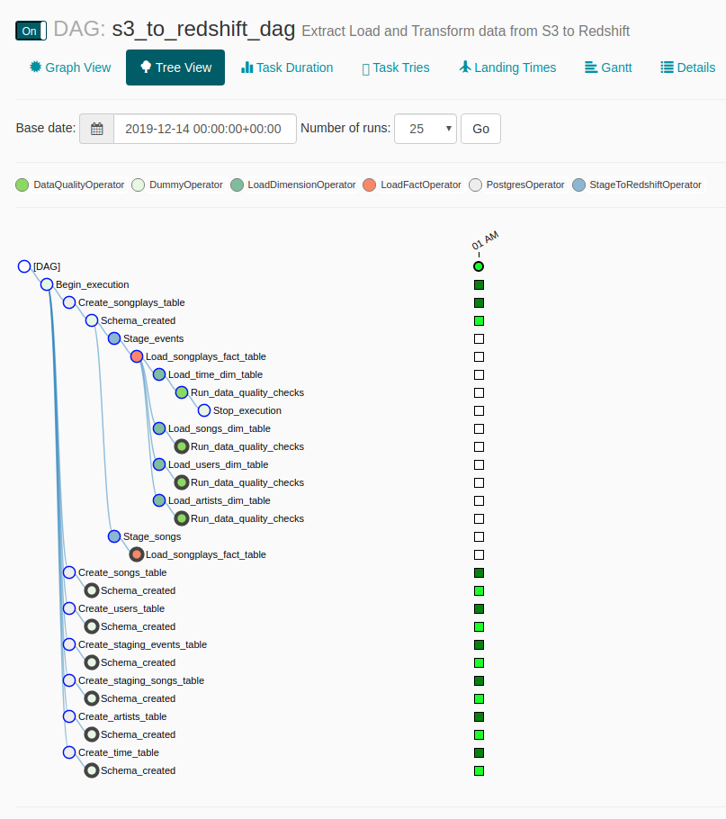

# Data-Pipeline-Orchestration-using-Airflow

## Introduction

A music streaming company, Sparkify, has decided that it is time to introduce more automation and monitoring to their data warehouse ETL pipelines and come to the conclusion that the best tool to achieve this is Apache Airflow.

The source data resides in S3 and needs to be processed in Sparkify's data warehouse in Amazon Redshift. The source datasets consist of JSON logs that tell about user activity in the application and JSON metadata about the songs the users listen to.


## Getting started


### Project structure explanation
```
airflow-data-pipeline
│   README.md                    # Project description
│   docker-compose.yml           # Airflow containers description   
│   requirements.txt             # Python dependencies
|   dag.png                      # Pipeline DAG image
│   
└───airflow                      # Airflow home
|   |               
│   └───dags                     # Jupyter notebooks
│   |   │ s3_to_redshift_dag.py  # DAG definition
|   |   |
|   └───plugins
│       │  
|       └───helpers
|       |   | sql_queries.py     # All sql queries needed
|       |
|       └───operators
|       |   | data_quality.py    # DataQualityOperator
|       |   | load_dimension.py  # LoadDimensionOperator
|       |   | load_fact.py       # LoadFactOperator
|       |   | stage_redshift.py  # StageToRedshiftOperator
```

#### Requirements

* Install [Python3](https://www.python.org/downloads/)
* Install [Docker Compose](https://docs.docker.com/compose/install/)
* [AWS](https://aws.amazon.com/) account and [Redshift](https://aws.amazon.com/redshift/) cluster 

Instead of installing docker and we can also install Ubuntu WSL on Windows and install airflow in that. Please refer [link](https://medium.com/@ryanroline/installing-apache-airflow-on-windows-10-5247aa1249ef) for more information. 

#### Clone repository to local machine
```
git clone https://github.com/sudip-padhye/Data-Pipeline-Orchestration-using-Airflow.git
```

#### Change directory to local repository
```
cd airflow-data-pipeline
```

#### Start Airflow container
Everything is configured in the docker-compose.yml file.
If you are satisfied with the default configurations you can just start the containers.
```
docker-compose up
```

#### Visit the Airflow UI
Go to http://localhost:8080

Username: user 

Password: password

#### Connect Airflow to AWS

1. Click on the Admin tab and select Connections.


2. Under Connections, select Create.

3. On the create connection page, enter the following values:
- Conn Id: Enter aws_credentials.
- Conn Type: Enter Amazon Web Services.
- Login: Enter your Access key ID from the IAM User credentials.
- Password: Enter your Secret access key from the IAM User credentials.

Once you've entered these values, select Save and Add Another.

4. On the next create connection page, enter the following values:
- Conn Id: Enter redshift.
- Conn Type: Enter Postgres.
- Host: Enter the endpoint of your Redshift cluster, excluding the port at the end.
- Schema: Enter dev. This is the Redshift database you want to connect to.
- Login: Enter awsuser.
- Password: Enter the password you created when launching your Redshift cluster.
- Port: Enter 5439.

Once you've entered these values, select Save.

## Airflow Tasks

We will create custom operators to perform tasks such as staging the data, filling the data warehouse and running checks. The tasks will need to be linked together to achieve a coherent and sensible data flow within the pipeline. 

## Datasets

The log data is located at `s3://udacity-dend/log_data` and the song data is located in `s3://udacity-dend/song_data`.

## Project Template

- There are three major components of the project:
1. Dag template with all imports and task templates.
2. Operators folder with operator templates.
3. Helper class with SQL transformations.
- Add `default parameters` to the Dag template as follows:
    * Dag does not have dependencies on past runs
    * On failure, tasks are retried 3 times
    * Retries happen every 5 minutes
    * Catchup is turned off
    * Do not email on retry
	
- There are four operators:
1. Stage operator 
    * Loads JSON and CSV files from S3 to Amazon Redshift
    * Creates and runs a `SQL COPY` statement based on the parameters provided
    * Parameters should specify where in S3 file resides and the target table
    * Parameters should distinguish between JSON and CSV files
    * Contain a templated field that allows it to load timestamped files from S3 based on the execution time and run backfills
2. Fact and Dimension Operators
    * Use SQL helper class to run data transformations
    * Take as input a SQL statement and target database to run query against
    * Define a target table that will contain results of the transformation
    * Dimension loads are often done with truncate-insert pattern where target table is emptied before the load
    * Fact tables are usually so massive that they should only allow append type functionality
3. Data Quality Operator
    * Run checks on the data
    * Receives one or more SQL based test cases along with the expected results and executes the tests
    * Test result and expected results are checked and if there is no match, operator should raise an exception and the task should retry and fail eventually

## Build Instructions

Run `/opt/airflow.start.sh` to start the Airflow server. Access the Airflow UI by clicking `Access Airflow` button. Note that Airflow can take up to 10 minutes to create the connection due to the size of the files in S3. 


#### Start the DAG
Start the DAG by switching it state from OFF to ON.

Refresh the page and click on the s3_to_redshift_dag to view the current state.

The whole pipeline should take around 10 minutes to complete.


